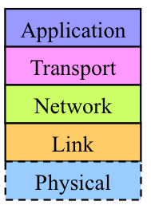

# Network
## Contents

- [인터넷](#인터넷)
- [프로토콜](#프로토콜)
- [인터넷 프로토콜 스택](#인터넷-프로토콜-스택)
- [osi 7 layer](#osi-7-layer)

## 인터넷
전 세계적으로 수십억개의 컴퓨팅 장치를 연결하는 컴퓨터 네트워크

## 프로토콜
1. 둘 이상의 통신 개체간에 교환되는 메시지 포맷과 순서뿐 아니라, 메시지의 송수신과 다른 이벤트에 따른 행동을 정의한것 
  
2. A protocol is a system of rules that define how data is exchanged within or between computers. Communications between devices require that the devices agree on the format of the data that is being exchanged. The set of rules that defines a format is called a protocol.  

3. 프로토콜을 구현하는 하드웨어와 소프트웨어

## 인터넷 프로토콜 스택
프로토콜 계층은 소프트웨어, 하드웨어 또는 둘의 통합으로 구현할수 있다

다양한 계층의 프로토콜을 모두 합하여 프로토콜 스택이라고 하며, 인터넷 프로토콜 스택은 5개 계층으로 구성된다

프로토콜 계층화의 장점 -  시스템 구성요소의 갱신이 쉽다

프로토콜 계층화의 잠재된 결점 - 한계층의 기능이 하위 계층과 기능적으로 중복된다, 한 계층에서의 기능이 다른 계층에서만 존재하는 정보(타임 스탬프값) 를 필요로 할 수 있다

   

5. 애플리케이션 계층

네트워크 애플리케이션과 애플리케이션 계층 프로토콜이 존재

애플리케이션 계층 프로토콜은 여러 종단 시스템에 분산되어 있어서, 한 종단 시스템에 있는 애플리케이션이 다른 종단 시스템에 있는 애플리케이션과 정보 패킷을 교환할때 애플리케이션 계층 프로토콜을 사용한다

애플리케이션 계층에서의 정보 패킷 - 메시지

## osi 7 layer

