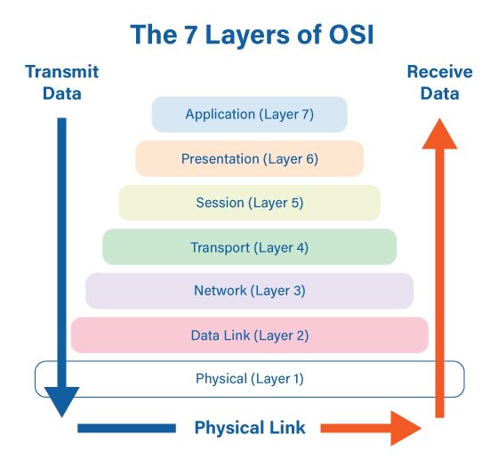

## OSI 7 layer

OSI - Open Systems Interconnection

ISO - International Standards Organization

과거에는 통신용 규약이 표준화되지 않았기 때문에 호환되지 않는 시스템이나 애플리케이션이 많았고 통신이 불가능했다. 

이를 하나의 규약으로 통합하려는 노력이 현재의 OSI7계층에 남아있다. 

OSI7 계층은 네트워크 동작을 나누어 이해하고 개발하는데 많은 도움이 되기 때문에 네트워크 주요 참조(레퍼런스) 모델로 활용되고 있지만 현재는 대부분의 프로토콜이 TCP/IP 프롵토콜 스택 기반이다. 

복잡한 데이터 전송 과정을 OSI 7 계층으로 나눠서 보면 이해하기 쉽고 계층별로 프로토콜을 개발해 네트워크 구성 요소들을 모듈화할수 있으며 데이터 흐름파악이 쉽고, 문제 해결이 편리하다

Layer 1-4 = 데이터 플로 계층 / 하위 계층

Layer 5-7 = 애플리케이션 계층 / 상위 계층

#### 7. Application

Protocol Data Unit = Data

사용자가 특정 어플리케이션을 이용해서 데이터를 이용하고 가공한다

#### 6. Presentation 

Protocol Data Unit = Data

encoding, encryption, compress

누구나 알수 있는데이터의 형태로 보내고 

#### 5. Session 

Protocol Data Unit = Data

연결

쌍방으로 동시에 주고받을지, 일방적으로 받기만 할지, 번갈아가며 주고받을지와 같은 회선의 생성, 유지, 종료에 대한 관리

#### 4. Transport 

Protocol Data Unit = Segments

tcp, udp

#### 3. Network

Protocol Data Unit = Packets

ip

#### 2. Data Link

Protocol Data Unit = Frames

전기 신호를 모아 우리가 알아볼 수 있는 데이터 형태로 처리 + 데이터에대한 에러 탐지

주소 정보를 정의하고 정확한 주소로 통신이 되도록한다 + 주소체계가 생김

스위치는 mac주소를 보고 통신해야 할 포트를 지정해 내보낸다

데이터 링크 계층 주요 장비 - 스위치(스위치의 적절한 필터링과 포워딩 기능으로 통신이 필요한 포트만 사용하고 네트워크 전체에 불필요한 처리가 감소하면서 이데넷 기반 네트워크가 급증하는 계기가됨), 브리지, 네트워크 인터페이스 카드

## Mac 주소

Media Access Control Address

실제 장치간 통신에 사용하는 주소

ARP프로토콜을 통해 IP주소가 할당된 장치의 MAC주소를 알아낸다

## 네트워크 인터페이스 카드

= 랜카드

pc나 서버에서 네트워크를 연결해주는 카드나 인터페이스를 지칭

<네트워크 인터페이스 카드 동작 방식>

1. 전기 신호를 데이터 형태로 만든다.
2. 목적지 MAC주소와 출발지 MAC주소를 확인한다.
3. 네트워크 인터페이스 카드의 MAC주소를 확인한다.
4. 목적지 MAC주소와 네트워크 인터페이스 카드가 갖고 있는 MAC주소가 다르면 데이터를 폐기한다.
5. 목적지 MAC주소와 네트워크 인터페이스 카드가 갖고 있는 MAC주소가 같으면 데이터를 상위계층에서 처리할 수 있도록 메모리에 적재한다.

#### 1. Physical 

Protocol Data Unit = Bits

물리적 연결과 관련된 정보를 정의

전기 신호가 물리계층 장비에 들어오면 이 전기 신호를 재생성하여 내보낸다 (물리계층 장비는 주소 개념이 없기때문에 전기 신호가 들어온 포트를 제외한 모든 포트에 같은 전기 신호를 전송)

물리 계층은 한 네트워크 노드에서 다른 네트워크 노드로 케이블을 통해 데이터를 전송하며 상위 계층은 물리계층에서 전송되는 비트에 의미를 할당한다

물리계층 주요 장비 - 허브, 리피터, 케이블, 커넥터, 트랜시버, 탭

